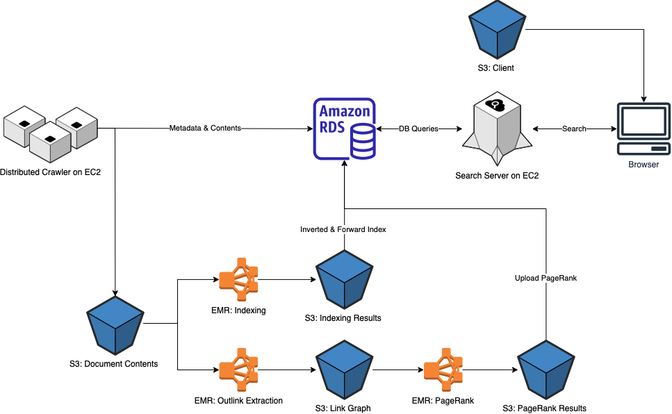

# Distributed Search Engine
A search engine partially based on Google, circa 1998.


- Retrieval and ranking incorporates BM25 and PageRank
- Distributed crawler/indexer/link analysis for computing document index and metadata
- A RESTful server that supports server-side caching and concurrent queries



See our [technical report](report.pdf) for system design, scalability, and more search demos.

## Extra Features
- Excerpts with highlighted hits are loaded dynamically and shown on the result page.
- Web UI integrates search results from News and Yelp webservices.
- Web UI supports search query autocomplete.
- Web UI supports loading 10 pages of search results.

## Tech

- [ReactJS](https://reactjs.org/)
- [MUI](https://mui.com/)
- [News API](https://newsapi.org/)
- [Yelp Fushion API](https://www.yelp.com/developers/documentation/v3/get_started)
- [IP Geolocation API](https://ip-api.com/)
- [Spark Java](https://sparkjava.com/)
- [JDBC](https://mvnrepository.com/artifact/org.postgresql/postgresql)
- [HikariCP](https://github.com/brettwooldridge/HikariCP)
- [Jsoup](https://mvnrepository.com/artifact/org.jsoup/jsoup)
- [Guava](https://mvnrepository.com/artifact/com.google.guava/guava)
- [OpenNLP](https://opennlp.apache.org)

## Quick Start

### Server

Specify `server/src/main/resources/config.properties` that contains your API keys and database credentials (not provided).

```ini
db.url=jdbc:postgresql://host:port/database
db.user=username
db.pass=password
news.apiKey=abcdefghijk
yelp.apiKey=abcdefghijk
```

```sh
cd server
mvn clean install
mvn exec:java
```

### Client

To run on local development machine, node >= 14.0.0 is required.

```sh
cd client
npm i
npm start
```

## Precomputed Components
See READMEs below for implemented features, source files, and instructions of each component.

- [Indexer](indexer/README.md)
- [PageRank](pagerank/README.md)
- [Crawler](crawler/README.md)


